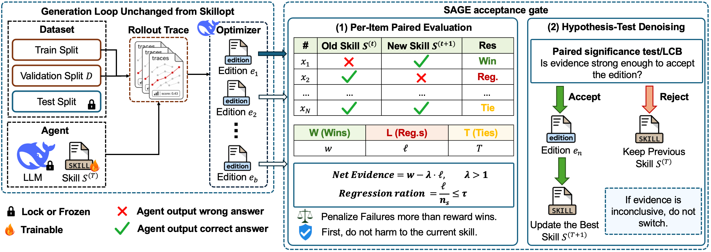

<div align="center">

<h1> SAGE</h1>

### Statistical Acceptance Gate for Skill Self-Evolution

*Accept a self-evolved skill only when the evidence says so — paired per-item validation, exact sign-test denoising, and explicit regression accounting.*

<p>
  
  
  
  
  
  
</p>

<br/>



<sub><b>Figure 1.</b> The generation loop is inherited unchanged from SkillOpt. SAGE replaces the acceptance step with <b>(1)</b> per-item paired evaluation of the new skill against the incumbent and <b>(2)</b> hypothesis-test denoising — committing the edition only when the evidence is strong enough, and otherwise keeping the previous skill.</sub>

</div>

---

## ✨ Overview

Self-evolving agents improve their **skill document** between epochs, then ask a
gate: *should this candidate skill replace the incumbent?* The common answer
compares a single aggregate score and commits whenever the candidate looks
slightly better. On finite validation sets that scalar comparison is noisy — it
rewards luck, smuggles in regressions, and quietly drifts the skill downhill.

**SAGE replaces that scalar gate with a paired statistical decision.** It lines
up the candidate and incumbent on the *same* validation items, turns the
comparison into a per-item ledger, removes sampling noise with an **exact
one-sided sign test**, and only commits when the denoised gain is positive
*and* the candidate does not break too much of what already worked. Disable the
safeguards and SAGE provably collapses back to the strict baseline gate — so it
is a **strict generalization**, not a different objective.

This repository is a **code-and-protocol package**. It ships the SAGE
implementation, a vendored SkillOpt integration, five benchmark launchers, and a
zero-API test suite. It intentionally **excludes** measured results, run
outputs, credentials, private machine details, and paper source files.

---

## 🧠 How the gate works

Following the pipeline in **Figure 1**, a candidate edition is **committed**
only when **all three** conditions hold:

| # | Test | Rule | Source |
|---|------|------|--------|
| 1 | **Denoise** | `wins > losses` **and** exact one-sided sign-test `p < α` | [`sage/denoise.py`](sage/denoise.py), [`sage/metrics.py`](sage/metrics.py) |
| 2 | **Gain** | discounted gain `wins − λ·losses > 0` | [`sage/evidence.py`](sage/evidence.py) |
| 3 | **Regression cap** | regression rate `losses / incumbent_correct ≤ τ` | [`sage/evidence.py`](sage/evidence.py) |

Otherwise the gate **abstains** and keeps the incumbent. The full decision lives
in [`sage/gate.py`](sage/gate.py).

> **Baseline recovery.** With `α = 1`, `λ = 1`, `τ = 1` (or `gate_select: strict`),
> the three tests reduce to *“commit iff the candidate wins more paired items than
> it loses”* — exactly the strict aggregate SkillOpt gate on paired binary
> outcomes. This equivalence is pinned by
> [`tests/test_gate_baseline_recovery.py`](tests/test_gate_baseline_recovery.py).

---

## 🔍 Why it matters

| | Strict scalar gate | **SAGE** |
|---|---|---|
| **Comparison** | aggregate mean, unpaired | per-item **paired** ledger |
| **Noise control** | none | **exact sign test** (`p < α`) |
| **Regression safety** | implicit | explicit cap `losses / incumbent_correct ≤ τ` |
| **Asymmetric cost** | none | tunable loss weight `λ` |
| **Backward compatible** | — | recovers the strict gate as a special case |

---

## 🗂️ Repository layout

```text
.
├── sage/                      # The SAGE acceptance gate (pure, dependency-light)
│   ├── evidence.py            #   paired per-item ledger: wins / losses / ties / regressions
│   ├── denoise.py             #   exact one-sided sign-test denoising
│   ├── metrics.py             #   exact sign-test p-value
│   ├── gate.py                #   commit / abstain decision
│   └── skillopt_bridge.py     #   adapt SkillOpt rollout rows → gate inputs
├── benchmarks/                # Five reproducible launcher scaffolds (+ JSON specs)
│   ├── spreadsheetbench/  livemath/  searchqa/  officeqa/  alfworld/
│   └── common/                #   shared launcher + schema
├── scripts/                   # run_benchmark.py · run_all.py · make_aaai_supplement.py · export_patch.py
├── configs/                   # SAGE / strict-baseline overlays + model credential template
├── SkillOpt/                  # Vendored SkillOpt runtime (upstream 41012e2 + SAGE patch)
├── patches/skillopt/          # sage_gate.patch — the exact SAGE integration diff
├── tests/                     # Zero-API test suite (12 modules)
├── tools/anonymize_scan.py    # Pre-submission privacy / anonymity scan
└── docs/                      # reviewer_guide · reproduction · repository_review
```

---

## 🚀 Quick start

```bash
# 1 — install
python -m pip install -r requirements.txt
python -m pip install -e .

# 2 — verify everything (no API keys required)
python -m pytest -q
python tools/anonymize_scan.py        # prints nothing when clean

# 3 — dry-run every benchmark launcher (no model calls)
python scripts/run_all.py --dry-run
```

Each dry-run prints the exact command it *would* execute and writes a launch
manifest under `outputs/` — safe to delete afterward.

---

## 📊 Benchmarks

Five launchers, each driven by a self-describing `spec.json`:

| Benchmark | Domain | Launcher |
|-----------|--------|----------|
| `spreadsheetbench` | Spreadsheet reasoning & manipulation | `python scripts/run_benchmark.py spreadsheetbench --dry-run` |
| `livemath` | Competition-style math | `python scripts/run_benchmark.py livemath --dry-run` |
| `searchqa` | Tool-augmented QA / retrieval | `python scripts/run_benchmark.py searchqa --dry-run` |
| `officeqa` | Office-document QA | `python scripts/run_benchmark.py officeqa --dry-run` |
| `alfworld` | Embodied / text-world agents | `python scripts/run_benchmark.py alfworld --dry-run` |

Full runs expect task files at `data/raw/<benchmark>/tasks.jsonl`. Those paths
are git-ignored on purpose, so licensed datasets can be materialized locally
without ever being committed.

---

## ⚙️ Running with SkillOpt

`SkillOpt/` is vendored from upstream commit `41012e2` plus the SAGE integration
in [`patches/skillopt/sage_gate.patch`](patches/skillopt/sage_gate.patch).

```bash
cd SkillOpt
python -m pip install -e .
python -c "import skillopt.engine.trainer"   # smoke check

# Train with the SAGE gate ...
python scripts/train.py --config configs/searchqa/default.yaml --gate_select sage

# ... or recover the strict SkillOpt baseline
python scripts/train.py --config configs/searchqa/default.yaml --gate_select strict
```

Live training requires local model credentials derived from
[`configs/model.example.yaml`](configs/model.example.yaml). Keep the filled copy
untracked.

### Gate knobs

| Parameter | Symbol | Default | Meaning |
|-----------|:------:|:-------:|---------|
| `sage_alpha` | `α` | `0.05` | Significance level of the exact sign test |
| `sage_loss_weight` | `λ` | `1.0` | Penalty weight on regressions in the gain term |
| `sage_regression_tau` | `τ` | `1.0` | Max allowed fraction of previously-correct items broken |

Reference overlays: [`configs/sage_gate.example.yaml`](configs/sage_gate.example.yaml)
and [`configs/skillopt_strict_gate.example.yaml`](configs/skillopt_strict_gate.example.yaml).
Default seeds are `seed: 42` and `split_seed: 42`.

---

## 🔬 Reproducibility

| Entry point | What it gives you |
|-------------|-------------------|
| [`docs/reviewer_guide.md`](docs/reviewer_guide.md) | 15-minute smoke test + full-run protocol |
| [`docs/reproduction.md`](docs/reproduction.md) | The SAGE method protocol, end to end |
| [`docs/repository_review.md`](docs/repository_review.md) | Repository review & residual boundaries |
| [`AAAI_REPRODUCIBILITY.md`](AAAI_REPRODUCIBILITY.md) | Checklist-item → file mapping |
| [`index.html`](index.html) | Static project homepage (GitHub Pages) |

Build a static, self-contained code appendix (caches, outputs, and local data
excluded):

```bash
python scripts/make_aaai_supplement.py   # → dist/sage-aaai-code.zip
```

---

## 📑 Citation

```bibtex
@misc{sage_skill_evolution,
  title  = {SAGE: A Statistical Acceptance Gate for Skill Self-Evolution},
  note   = {Reproduction package; manuscript under review},
  year   = {2026}
}
```

---

## 🙏 Acknowledgements

SAGE is built directly on top of **[SkillOpt](https://github.com/microsoft/SkillOpt)**,
the self-evolving agent-skill training framework released by the
**Microsoft SkillOpt team**. SkillOpt provides the optimizer loop, the training
harness, and the strict validation gate that SAGE extends, generalizes, and
compares against as its baseline.

We are sincerely grateful to the SkillOpt authors for open-sourcing their
**code** and **baseline** under a permissive license — this work would not have
been possible without their generosity to the community.

- 📦 Code: <https://github.com/microsoft/SkillOpt>
- 🌐 Project page: <https://microsoft.github.io/SkillOpt/>
- 📄 Paper: <https://arxiv.org/abs/2605.23904>

The vendored `SkillOpt/` tree retains its original
[`SkillOpt/LICENSE`](SkillOpt/LICENSE) (© Microsoft Corporation) for upstream
provenance.

---

## 📜 License

The SAGE wrapper code in this repository is released under the
[MIT License](LICENSE). Vendored SkillOpt code remains under its own upstream
MIT license.
